# Visual Puzzle Tasks and Parameters

## Visual Examples

`Visual Puzzle` tasks evaluate pattern matching over color, shape, size, and compositional rules.

The unified mainline currently includes `10` tasks, all implemented in `data/visioncentric/visual_puzzles/data_generation.py`.

### Symmetry

|      Task       |                                        Puzzle                                         |                                        Solution                                         |
| :-------------: | :-----------------------------------------------------------------------------------: | :-------------------------------------------------------------------------------------: |
| `color_hexagon` |  |  |
|  `color_grid`   |  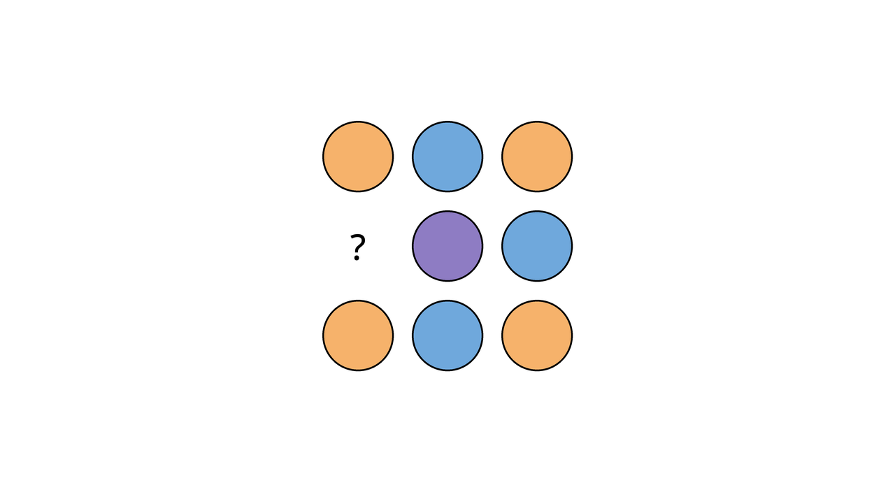   |  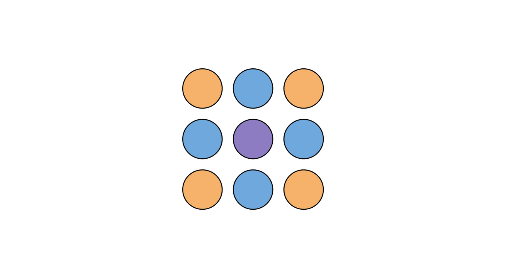   |
|   `size_grid`   |   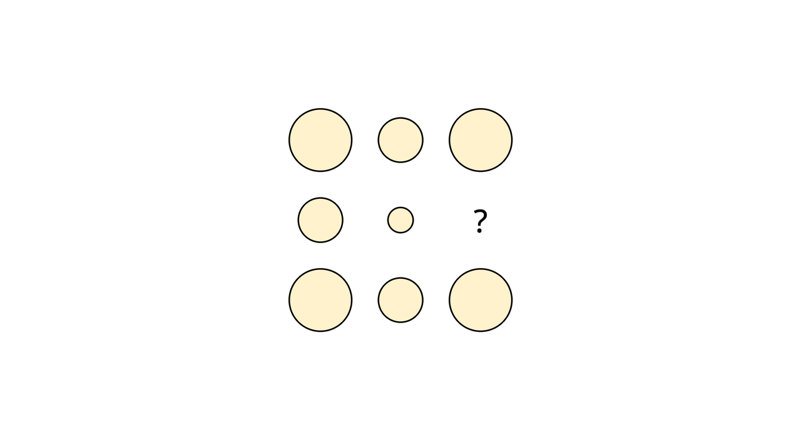   |   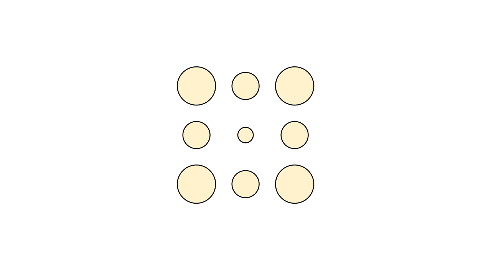   |
| `shape_reflect` | 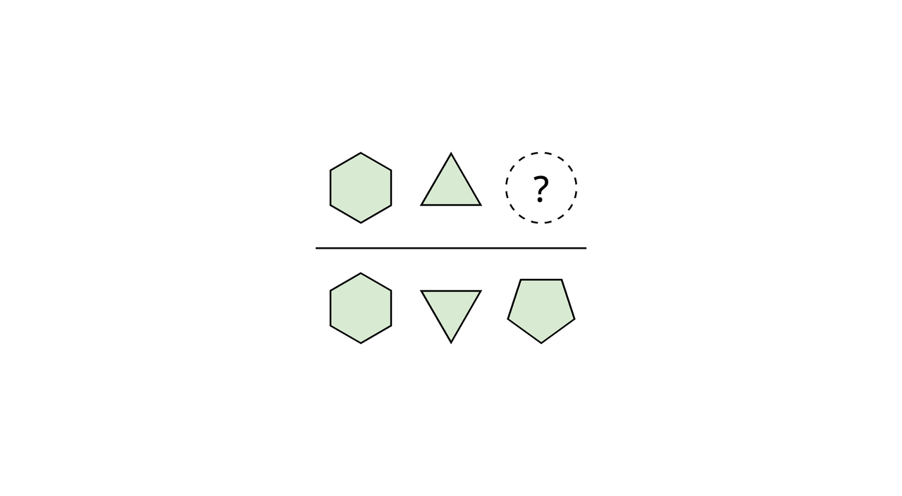 | 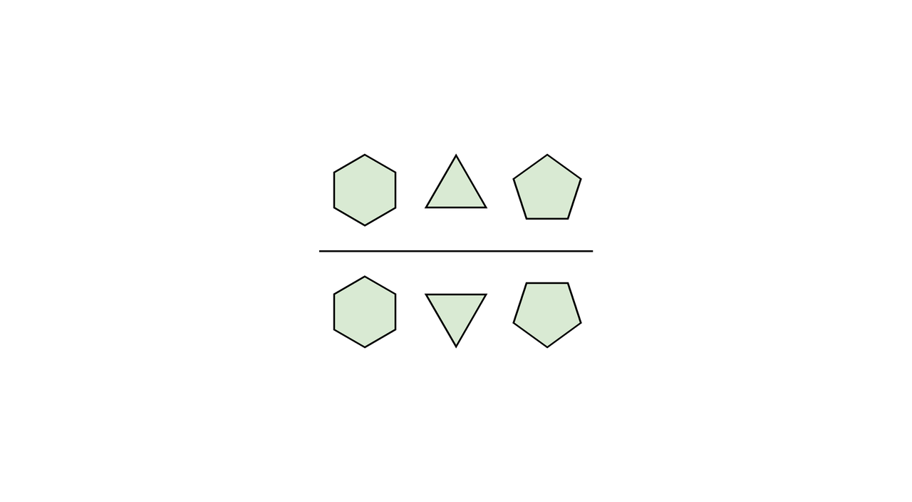 |

### Gradient

|     Task     |                                       Puzzle                                       |                                       Solution                                       |
| :----------: | :--------------------------------------------------------------------------------: | :----------------------------------------------------------------------------------: |
| `color_size` |  |  |
| `size_cycle` | 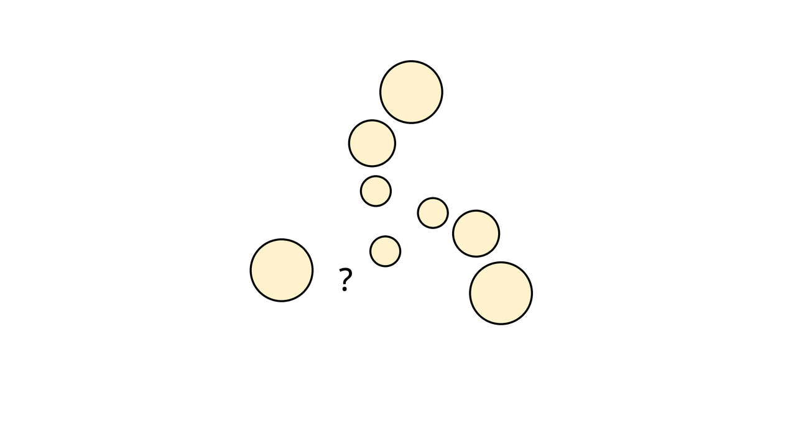 | 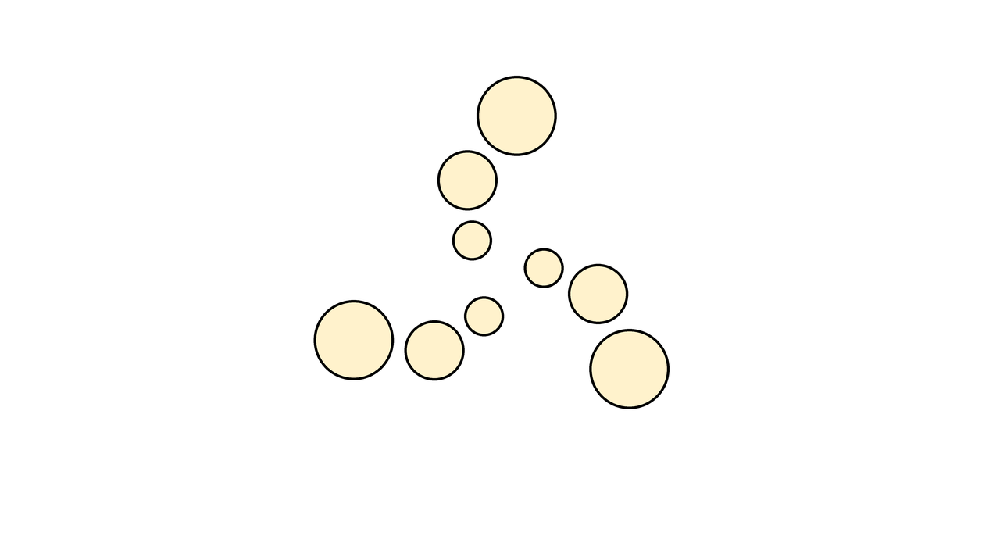 |

### Compositionality

|           Task           |                                             Puzzle                                             |                                             Solution                                             |
| :----------------------: | :--------------------------------------------------------------------------------------------: | :----------------------------------------------------------------------------------------------: |
|  `polygon_sides_color`   |     |     |
| `rectangle_height_color` | 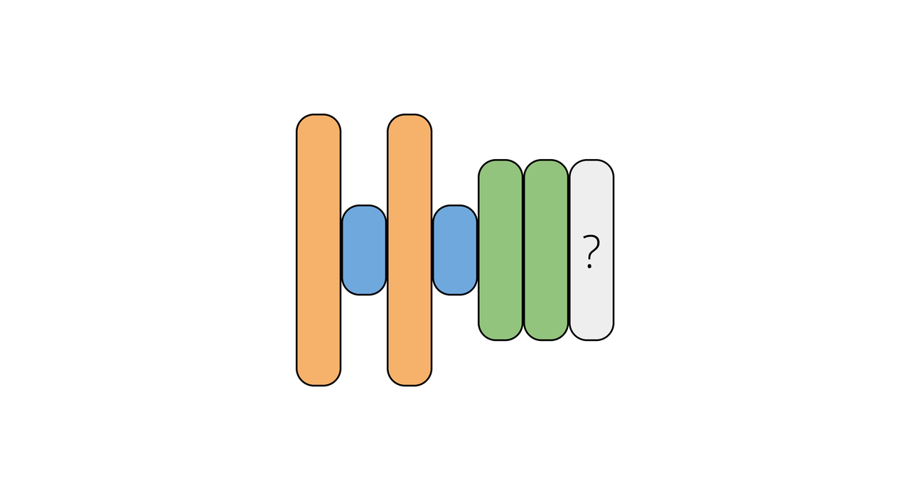 | 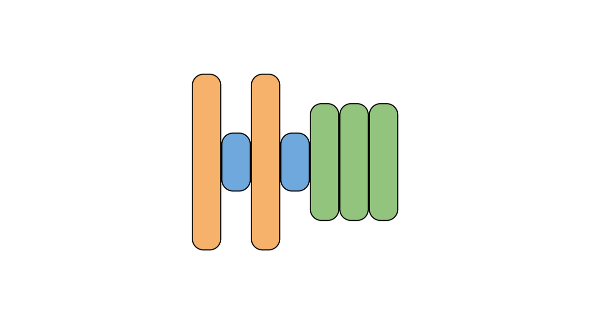 |
| `color_overlap_squares`  | 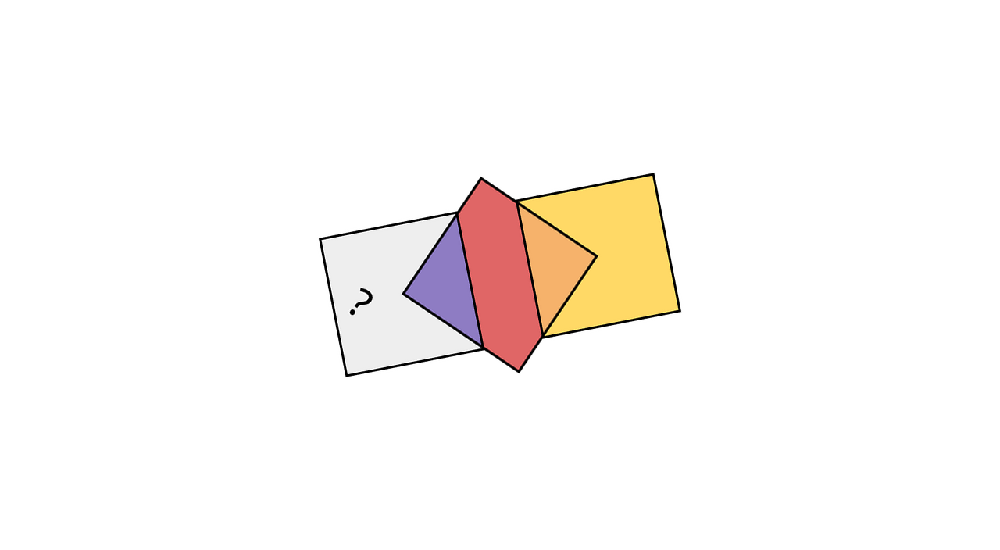  | 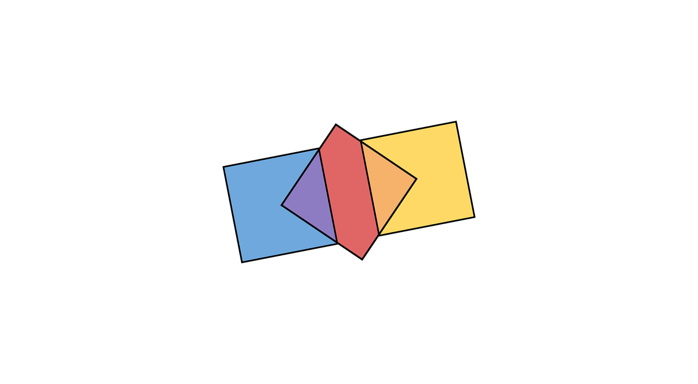  |
|    `shape_size_grid`     |    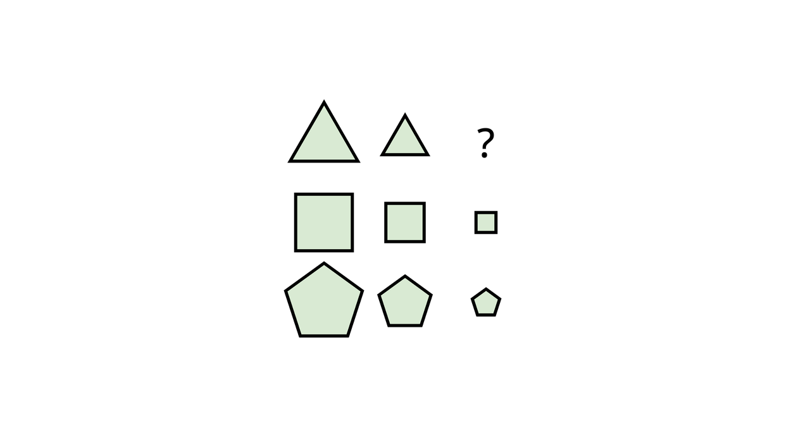     |    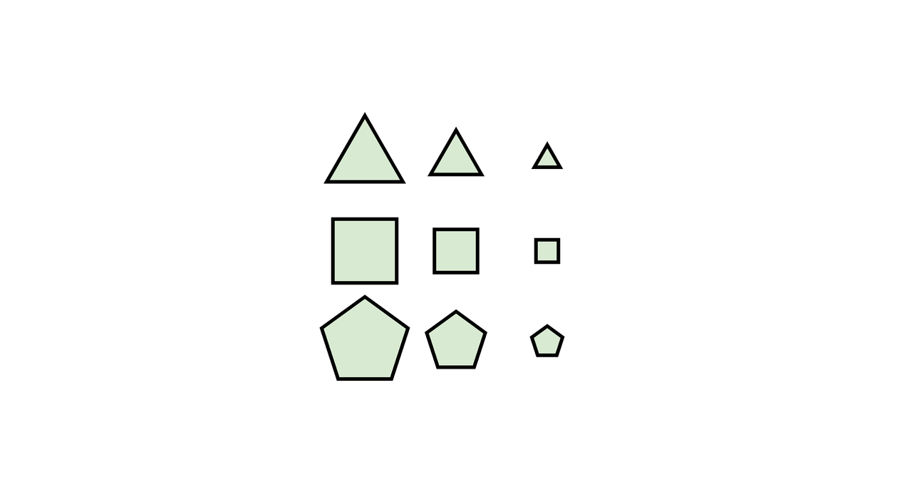     |

## Data Records

Each sample usually contains:

- `question`.
- `answer`.
- `options`.
- `caption`.
- `explanation`.
- `deduction`.
- the generation / reasoning puzzle image `image` (for this task family, `reasoning_image` is the same file).
- the solution image.
- `ti2v_prompt` for image-conditioned video generation.
- `ti2t_prompt` for image-conditioned reasoning / VLM training.
- `ti2i_prompt = null` and `ti2ti_prompt = null`, because `visual_puzzle` does not enter the `TI2I` / `TI2TI` export branches.

In the unified pipeline, these fields are converted into `CanonicalSample`, with the answer normalized into `correct_option`.

## Evaluation Logic

These tasks no longer ship separate task-local evaluators.

Batch offline evaluation is unified in `data/evaluation/offline/visual_puzzle.py`, where the core logic is:

- if the input is a video, first identify the frame that best matches the reference solution.
- then compare the best frame or predicted image against the solution image.

## Parameters Exposed by the Unified CLI

The unified CLI currently exposes only a small set of direct parameters:

| Parameter                              | Default | Description                  |
| -------------------------------------- | ------- | ---------------------------- |
| `--seed`                               | `42`    | Random seed.                 |
| `--task-config` / `--task-config-path` | `None`  | Inject task-specific fields. |

In addition, `data.generate` currently passes the following internal fields automatically:

| Internal Field | Fixed Value   | Description                          |
| -------------- | ------------- | ------------------------------------ |
| `target_size`  | `(1280, 704)` | Final output resolution.             |
| `unique`       | `True`        | Deduplicate by puzzle image content. |

The visual puzzle generators now also include two quality-of-life safeguards that matter during large batch generation:

- Font loading no longer hard-fails when the repository-local OpenSans files are absent. The generator first tries the configured font path, then common system fonts, and finally Pillow's default font.
- Border-sensitive layouts such as `size_cycle` clamp text placement and shrink the outer ring geometry slightly so question marks, circles, and outlines do not touch the outermost canvas pixels.

## Task Fields

These task classes use a `BaseModel`-style constructor, and their fields can be overridden directly through `task_config`.

### `color_grid`

| Field          | Default                                         |
| -------------- | ----------------------------------------------- |
| `image_size`   | `512`                                           |
| `scale_factor` | `4`                                             |
| `path_font`    | `fonts/OpenSans-Medium.ttf`                     |
| `colors`       | `blue / green / yellow / red / purple / orange` |

### `color_hexagon`

| Field          | Default                                         |
| -------------- | ----------------------------------------------- |
| `image_size`   | `512`                                           |
| `scale_factor` | `4`                                             |
| `path_font`    | `fonts/OpenSans-Medium.ttf`                     |
| `colors`       | `blue / green / yellow / red / purple / orange` |

### `color_overlap_squares`

| Field          | Default                                         |
| -------------- | ----------------------------------------------- |
| `image_size`   | `512`                                           |
| `scale_factor` | `4`                                             |
| `path_font`    | `fonts/OpenSans-Medium.ttf`                     |
| `colors`       | `blue / green / yellow / red / purple / orange` |
| `numbers`      | `[1..9]`                                        |
| `num_sides`    | `4`                                             |
| `rotate_range` | `(-45, 0)`                                      |

### `color_size`

| Field          | Default                                |
| -------------- | -------------------------------------- |
| `image_size`   | `512`                                  |
| `scale_factor` | `4`                                    |
| `path_font`    | `fonts/OpenSans-Medium.ttf`            |
| `colors`       | `4` shade levels for each color        |
| `shape_sides`  | `circle / square / pentagon / hexagon` |

### `polygon_sides_color`

| Field          | Default                                         |
| -------------- | ----------------------------------------------- |
| `image_size`   | `512`                                           |
| `scale_factor` | `4`                                             |
| `path_font`    | `fonts/OpenSans-Light.ttf`                      |
| `colors`       | `blue / green / yellow / red / purple / orange` |

### `rectangle_height_color`

| Field          | Default                                         |
| -------------- | ----------------------------------------------- |
| `image_size`   | `512`                                           |
| `scale_factor` | `4`                                             |
| `path_font`    | `fonts/OpenSans-Light.ttf`                      |
| `colors`       | `blue / green / yellow / red / purple / orange` |

### `shape_reflect`

| Field          | Default                                  |
| -------------- | ---------------------------------------- |
| `image_size`   | `512`                                    |
| `scale_factor` | `4`                                      |
| `path_font`    | `fonts/OpenSans-Medium.ttf`              |
| `color`        | `#d9ead3`                                |
| `shapes`       | `triangle / square / pentagon / hexagon` |

### `shape_size_grid`

| Field          | Default                                  |
| -------------- | ---------------------------------------- |
| `image_size`   | `512`                                    |
| `scale_factor` | `4`                                      |
| `path_font`    | `fonts/OpenSans-Medium.ttf`              |
| `color`        | `#d9ead3`                                |
| `shapes`       | `triangle / square / pentagon / hexagon` |

### `size_cycle`

| Field          | Default                     |
| -------------- | --------------------------- |
| `image_size`   | `512`                       |
| `scale_factor` | `4`                         |
| `path_font`    | `fonts/OpenSans-Medium.ttf` |
| `color`        | `#fff2cc`                   |

### `size_grid`

| Field          | Default                     |
| -------------- | --------------------------- |
| `image_size`   | `512`                       |
| `scale_factor` | `4`                         |
| `path_font`    | `fonts/OpenSans-Medium.ttf` |
| `color`        | `#fff2cc`                   |

## Parameter Injection Example

```bash
python3 cli.py data generate \
  --tasks color_grid color_size \
  --count 20 \
  --output-root ./outputs/visual_puzzles \
  --task-config '{
    "color_grid": {
      "image_size": 640,
      "scale_factor": 3,
      "target_size": [1440, 810]
    },
    "color_size": {
      "image_size": 768,
      "scale_factor": 2
    }
  }'
```

## Current Training Boundary

`visual_puzzle` can be exported into `ms-swift` / `BAGEL` `vlm` data and into `diffsynth-video` as pure `TI2V` samples.

It is intentionally excluded from `diffsynth-image` and `BAGEL` `edit` exports, and its `diffsynth-video` rows leave `ti2ti_*` blank.

The current `GRPO` reward uses normalized exact text matching, which is a good fit for answers that are usually single color words, shape words, or size words.
